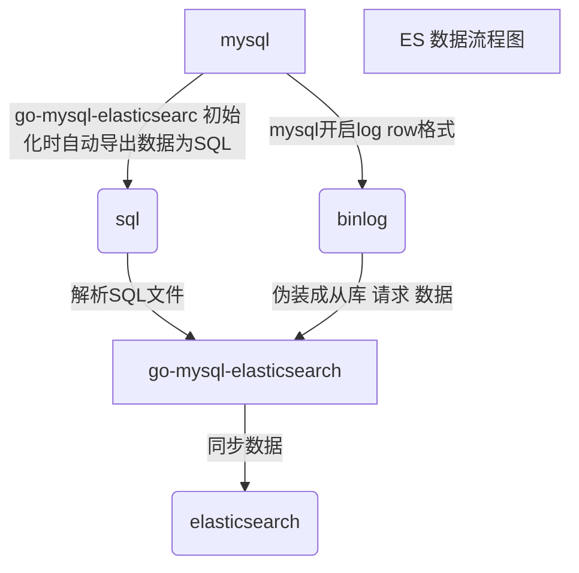

---

title: Thinkphp + go-mysql-elasticsearc + elasticsearch
date: 2022-01-12 17:44:17
tags:
---

# 前言
> 项目使用 thinkphp  + mysql 对列表进行查询，列表数据量达到千万级别，且搜索维度效果，故采用elasticsearch进行搜索

> 为了尽量不改动代码逻辑，需要实现

- 数据自动同步至ES ( 使用  go-mysql-elasticsearch）
- 平滑切换TP自带的数据库查询操作到ES（自定义 query，转化TP 的查询条件为 ES的查询条件）





# 功能使用

### 说明

>  php 中\\think\\db\\query\\Elasticsearch  为 处理 TP语法到 ES 中的的查询语法，调用方式通DB 相同

> 暂只支持where , whereor ,wherein  , limit ,  order  ,find select  ,value ,sum 方法

- 查询方式

```
Elasticsearch\Elasticsearch\FinanceBillIncome::where('xxx','xxx')->find();
```

- 列表时 先通过ES 查询出主键ID, 再通过主键 查询出明细数据
- 列表查询通过 count 方法
- 列表头部统计 ，通过如下方式查询

```php
   ->sum(   [
                        'expect_fee',
                        'adjustment_fee',
                        'confirm_fee',
                    ]);
```

- 暂不支持 join，必须join 的降级为DB 处理

- alias 方法指定后，ES 查询时将 自动去除查询条件与字段中头部别名

### 使用步骤

> 先通过

- .env

  ```
  # 搜索引擎地址
  ELASTICSEARCH_HOST_NAME='192.168.x'x.133'
  ELASTICSEARCH_HOST_PORT='9200'
  ELASTICSEARCH_INDEX_PREFIX='xxx_'
  ```

- database.php

```php
    'elasticsearch'=>[
        'prefix' =>  env('ELASTICSEARCH_INDEX_PREFIX'),
        'type'     => 'elasticsearch',
        'hostname' => env('ELASTICSEARCH_HOST_NAME'),
        'hostport' => env('ELASTICSEARCH_HOST_PORT'),
        'debug' => true,
        // 是否严格检查字段是否存在
        'fields_strict' => false,
        // 数据集返回类型 array 数组 collection Collection对象
        'resultset_type' => 'array',
        'sql_explain' => false,
        'query'           => '\\think\\db\\query\\Elasticsearch',
    ],

```

- builder [文件](\uploads\file\elasticsearch\think\db\builder\Elasticsearch.php)

- connector[文件](\uploads\file\elasticsearch\think\db\connector\Elasticsearch.php)
- query[文件](\uploads\file\elasticsearch\think\db\query\Elasticsearch.php)

- 新增 class  如

```
Elasticsearch\Elasticsearch\FinanceBillIncome
```

- 初始化 ES，创建 index

```
/cron/elasticsearch/initSearch
```
- 输出的内容 为 go-mysql-elasticsearch 中的配置
- 启动  go-mysql-elasticsearch


# 监控

1. 定时 monitor 表中更新时间
2. 定时查询ES 中monitor  的时间
3. 对比时间差异，差异时间为延迟时间
